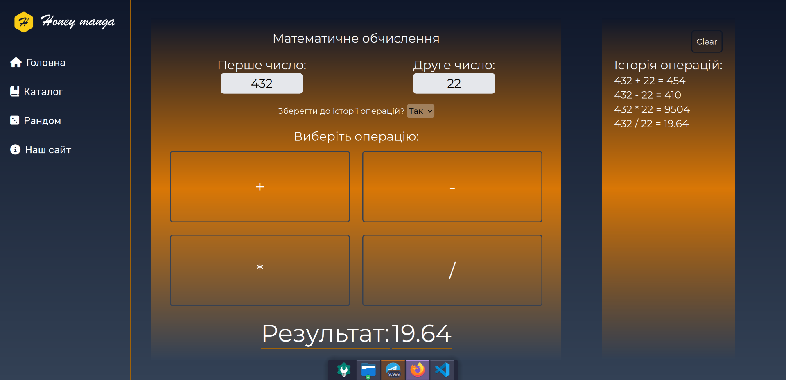
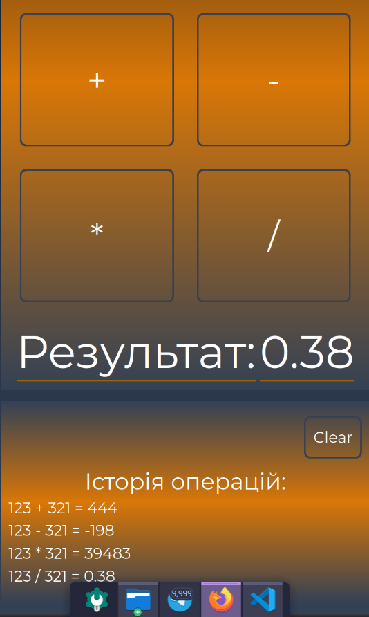

# Web Lab — Math Calculator

A simple responsive web calculator built with vanilla JavaScript and Tailwind CSS.

## Features

- Basic arithmetic: addition, subtraction, multiplication, division
- Optional operation history with a clear button
- Responsive sidebar navigation (collapsible on mobile)

## Tech Stack

- HTML / CSS / JavaScript (no frameworks)
- Tailwind CSS v4

## Screenshots

### Desktop

### Mobile

